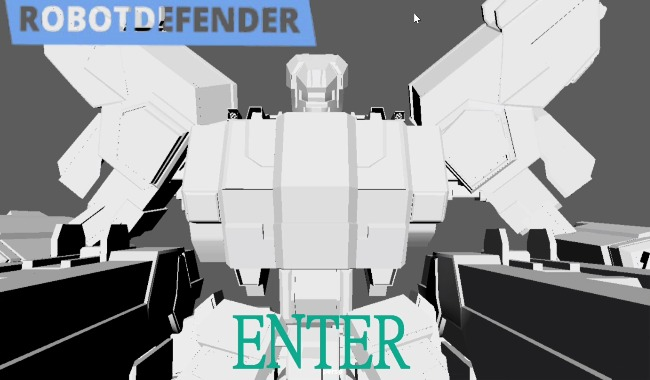

# ROBOTDEFENDER（就職作品）

HAL大阪の２年制課程にて制作した、3Dロボットアクションゲームです。
プレイヤーはロボットを操作し、次々と現れる敵を打ち倒していきます。

## 使用技術
- C++
- DirectX 11
- IDE：Visual Studio 2022
-  自作プレイヤー操作、射撃、ダッシュ、敵AI、弾幕処理、被弾演出
制作期間：約3ヶ月（週20時間）
制作人数：1名（個人制作）

## 操作方法
| W / A / S / D   | 移動                   
| マウス右クリック | 武器構え    
| マウス左クリック | attack                 
| スペースキー     | ダッシュ               
## 🔧 実装システム・技術ポイント

## 自分の担当
- プレイヤー移動
- 敵AI（追跡、射撃）
- 武器切替、爆発エフェクトの制御
- カメラ追従
- HPに応じたダメージ演出

### プレイヤー
- 慣性シミュレーション付きの移動処理（速度加算／摩擦減速）
- ダッシュ／ジャンプ処理（距離制限あり）
- プレイヤーの回転に応じて武器の位置・角度補正

### 武器・射撃システム
- 銃（両手持ち）：プレイヤーに追従し、右クリックで構え可能
- 銃口位置から射撃、弾道と方向は回転行列で制御
- 右クリック中は自動でプレイヤー視線方向と銃角度を補正

### パンチ（近接攻撃）
- 左右パンチモデルを切替で使用（交互出拳）
- 出拳時の前進移動とAABB更新、ヒット時爆発演出
- 一定時間後に拳を元の位置へ戻す

### 敵AI（状態マシン制御）
- Idle → Patrol → Chase → Attack / Retreat のステート遷移
- プレイヤーとの距離に応じて行動切替
- 一定距離内で自動攻撃トリガーを発動

### 衝突処理・演出
- AABBによるプレイヤー・敵・弾丸の当たり判定
- 被弾時FPS風演出（視界破損、瀕死時エフェクト）
- 爆発・破片演出を座標に基づいて動的生成

---
## 動画・ダウンロード
- プレイ動画:
- 
- https://xgf.nu/iV08U
- https://drive.google.com/file/d/139DJ7kpUWEF8CIcsMiEY360uTwVGH_nD/view?usp=sharing

- 完成品ZIP：
- 
- https://xgf.nu/o00N6
- https://drive.google.com/drive/folders/1yoLZX_avK8zUT3EPCaLswbLd8MiXHpUk?usp=sharing

## 👤 担当・実装箇所

- プレイヤー移動処理、慣性／摩擦計算、ダッシュ実装
- プレイヤーと連動する両手銃・拳の制御
- 武器切替・射撃処理・銃口追従システム
- パンチアニメーションとAABBヒット処理
- 敵AI（状態マシン）、敵のリスポーン制御
- 衝突判定全般（弾／敵／拳）、HP減少ロジック
- エフェクト制御（爆発・ガラス破片）
- カメラ追従、HPに応じた画面演出（視界損壊・瀕死時血エフェクト）

---

## 📝 コメント

ゲームプレイにおける「気持ちよさ」を重視し、弾道／ダッシュ／ヒット時の演出／パンチ動作など細部までこだわって制作しました。
状態マシンAI、動的エフェクト、当たり判定処理など、技術的にも試行錯誤を重ねながら実装を行いました。

